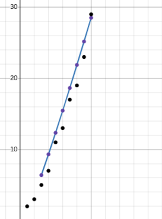

**Attempt #1:**

**Reciprocal of the Sum of Primes**

**11/05/2026 - 14/05/2026**

&emsp;My first attempt with the conjecture of attempting to identify a formula for finding prime numbers came with the reciprocal of the sum of $n$ primes. If there was an equation by which a fraction could be attained, where the fraction attained at $n+1$ is smaller than the fraction attained at $n$, we might be able to find the $n^{\text{th}}$ prime number. For example, if the first fraction attained by the function gets $\frac{1}{2}$, the second fraction should be $\frac{1}{2+3}$, or $\frac{1}{5}$, the third fraction attained by the function should be $\frac{1}{2+3+5}$, or $\frac{1}{10}$, and so on.

&emsp;My rationale behind this attempt was that it would be difficult to model the regression and the pattern between primes—to which, there is no clear pattern, at least not one mathematicians have discovered. Perchance there may exist an equation with an asymptote that can aid in the creation of an $n^{\text{th}}$-prime number formula.  

&emsp;I initially created a table in Desmos complete with $n$, the prime at $n$ (denoted as $P(n)$ ), and the reciprocal of the sum of primes between 1 and $n$ (denoted as $S_{p}(n)$ ).

| $n$ | $P(n)$ | $S_{p}(n)$ |
| :---: | :---: | :---: |
| 1 | 2 | $\frac{1}{2}$ |
| 2 | 3 | $\frac{1}{5}$ |
| 3 | 5 | $\frac{1}{10}$ |
| 4 | 7 | $\frac{1}{17}$ |
| 5 | 11 | $\frac{1}{28}$ |
| 6 | 13 | $\frac{1}{41}$ |
| 7 | 17 | $\frac{1}{58}$ |
| 8 | 19 | $\frac{1}{77}$ |
| 9 | 23 | $\frac{1}{100}$ |
| 10 | 29 | $\frac{1}{129}$ |

&emsp;My idea was to create a regression equation for $S_{p}$ with respect to $n$. If there is no visible regression to formulate an equation for $P(n)$, there might be a visible regression to formulate an equation for $S_{p}$. And so, this was the equation generated by the regression:

$$S_{p}(n) = 1.10089 \cdot (0.448005)^n \ \lbrace n \ge 1 \rbrace$$

&emsp;Using the regression equation, we can manufacture the following formula to identify the $n^{\text{th}}$ prime integer:

$$P(n) = \frac{1}{S_{p}(n)} - \frac{1}{S_{p}(n-1)}$$

&emsp;We can now create a table within Desmos to test out our prime integer formula, with $A_{p}$ representing the values of the actual $n^{\text{th}}$ prime.

| $n$ | $P(n)$ | $A_{p}$ |
| :---: | :---: | :---: |
| 1 | $\text{undefined}$ | 2 |
| 2 | 2.4981902 | 3 |
| 3 | 5.5762551 | 5 |
| 4 | 12.446859 | 7 |
| 5 | 27.782858 | 11 |
| 6 | 62.014615 | 13 |

&emsp;There appears to be a significant difference between the actual prime integers and the prime integers generated by our $P(n)$ equation, starting when $n = 4$. The issue that arises with this formula is that I hadn’t taken into consideration the Law of Small Numbers. That is, even though smaller numbers may produce near-similar results to the data of the original table, as the input $n$ gets larger, the actual results skew from the predicted results by a significant amount that deems the regression equation of little use.

&emsp;The regression equation generated was an exponential regression; however, I brought about the conjecture that perchance I could employ a different regression equation that could bring about results closer to the predicted results. The subsequent equation generated through a power regression was as follows:

$$S_{p}(n) = 0.928019 \cdot (n)^{-2.12109} \ \lbrace n \ge 2 \rbrace$$

&emsp;Now testing out the $P(n)$ formula with the new $S_{p}$ formula, we get the following:

| $n$ | $P(n)$ | $A_{p}$ |
| :---: | :---: | :---: |
| 1 | $\text{undefined}$ | 2 |
| 2 | $\text{undefined}$ | 3 |
| 3 | 6.3903254 | 5 |
| 4 | 9.3143445 | 7 |
| 5 | 12.343368 | 11 |
| 6 | 15.455985 | 13 |

&emsp;There’s still a slight discrepancy with the integers between the actual prime number at $n$ and the estimated prime number generated by the $P(n)$ formula, and this is made evident when we look at the graph generated by the new equation for $P(n)$ and $A_{p}$.

![](data:image/png;base64,iVBORw0KGgoAAAANSUhEUgAAAREAAAFxCAIAAADbAguDAAAAA3NCSVQICAjb4U/gAAAgAElEQVR4nO2deXAb533398K5WCwOgid4ixIPiZTkxJZ8yLZkSXUsH1FUN55krGmamb5TTyYTT8czTtx2knb6NrU1idNxO9OprMaW09d2bVZyreSNnei1Y9eXLIukeIgUxQskRRLXLoAFdhe7eP9YiaZ4icAuuQvg9/mLxPHFD7v4As8+x/dBM5kMshyyLEejUYqiTCbTsg9YOw888MDRo0cPHTpkt9tzFtGqHgPqMAzjcDhU6vA8f+7cuebmZq/Xq74ekiTNZjPoLIXneUzN8wGgCAHPAEB2gGcAIDvAMwCQHeAZAMgO8AwAZAeR29NeeeWVN998U5Kk6urqJ554oqmp6Z133nnxxRfn5uZ27tz55JNPVlVVaVsoABiEXH5nvvjii87Ozu9///snT56srq4+c+ZMb2/v8ePHv/e9750+fRrH8XfeeScajWpeKwAYgVw8097efvLkyTvuuAPDsFAoVFNT093d3dTUVFNTQ1HUvffe29fXxzCM5rUCgBHIxTM4jlut1n/913/dtWsXhmG7d+/mOI6iKGWE1efzhUIhnue1LhUADAExMDCw7B2yLLMs63A4CGLxNY/NZispKfnOd77zzW9+8/nnn//nf/5ngiBsNhvHceFwWJIkBEEkSRoZGVGck0gkpqamBgcHrVZrzoWuUo9eOrFYzG63q587o4kOz/NjY2M4js/NzRmhnkLVEQSBkGV5pdeYZ+HtPp/PbrfH43GTyUQQxK5duzo7OxsbG2OxWCaTMZlMkUjE5XLhOD7/3Ewmk8lklkplhSzL6kW01ZmXUq9jtPcFOqvoEM3NzSvdF41GnU7nou9jFEXfeOONV1555Uc/+lFHR0d3d3dZWdm+ffv+/u//PhQK1dbWnj17trW1tbS01Ol0Kk9xOByVlZWbN28usDmamsyt1HCOZiKRaGpqgjma66rD8zyBYSte0mAYhqLo0gccPHiwq6vr29/+tsvlam9v/8EPftDU1PT4448/++yzoVBox44d+/fvp2kaRdH5pyg6q7zWWsCuo0ZEQx1N3pRW9cyfLIPUU6g6GIbl0qZ3OBx/9Vd/9fTTTyMIguO4yWTCMOzQoUMHDx7MZDLKLQsNAwCFRC6eQVHUbDYv+o3DcRzHcY2qAgDjAnNnACA7wDMAkB3gGQDIDvBM4RCPx9PptN5VFD7gmULg5Zdf3r179ze+8Y09e/b84he/CIVCeldUyIBn8p5Tp079wz/8Q1dXVyKRGBoaeuqpp37zm99wHKd3XQULeCbv+e1vfxsIBOanKfE8/9577wWDQb3rKljAM3kPx3HKvNh5ksnkolsADQHP5D233nqrx+NZeMuOHTtcLpde9RQ84Jm857vf/e63vvWtkpIS5d+jR48+8sgj4Jn1Q9UaEsAImEymjrpvHNheenVm0m713Nq022kvhfl+6wf8zuQ9758ZPv/+lFkuqy7Z4XXUnX9/5sJHU1xc1LuuggU8k/cM9c6x0ZSyNAFFUSmdGbkUSsRhbfl6AZ7Je0wmHMVuaIkRJhyDttm6AZ7Je9p2VtBu2/y/KIpu2eajXLlHLwCrA57Je3bcUdW6r8bssWRQxFfhePTPt2+9tdJsgbVM6wX0m+U9GI7GSiyDTeROL/G/vnFbjb8Ex+GrcB0Bz+Q98VT6YiAaE6W6MtzpwAkCDLO+EIlEYtk7JElKJBIYhqnfG1CSJCUVZaV9CNcownGc+noMqJNIJFAUzVnnwkh0KsxtKrPbiFgyySUSqq5klHoQBBFFVb3VBtRR5q2q1OF5nrjp51jNB32RiEqpzHXUF1NIOgNTLJsUb6nzUNakJvXMV2UcHSMc53kRgiTJZe+TZVkURZIkVeZNItezau12u8p8s3Q6rUn+ZTqdJklSfS6ZQXSGZ1PxVHp7g5dKJUmSXOmEblg9mutIkmS329Xnm2miQxAEsdIkCxRFlbu0moUxL5jz0xf9oUZHZTHa6syTw9MHp9jhmXiFy1blsadmMUSL46PJeddQBzHY+YLrxfymb4JhOWFbrdtNqvr6BNYOeCa/6QswbDLdXud22tV21QBrBDyTx0yGuN4JBsfQzZVOhxU8s0GAZ/KYgUmGSQjttS43aYL5ZRsGeCaPUS5m2mvdLriY2UDAM/kKw4ndY9FYKt3ipykbNMw2DvBMvjIwycyxqRa/s9xlxTFomW0c4Jl8pW88ynJiex00zDYa8ExeIkmZvkk2lhJb/S5omG0w4Jm85NI0OzoT9zmtjWUOqwlO4oYChzsv6Ztg2KTYXut2OcwQMbPBgGfykv4Aw3JiazX0mOkAeCb/GJuL9wcYDEO31rgoGP7fcMAz+Ud/gGE4cVuNy+0wQ7ts4wHP5B/9AZblhBY/TVlhaboOgGfyjHBc6BoNx5LpFj/ttMPIjA6AZ/KM/gATSYjNVc5aH2mGuAw9gIOeZ/RPMiwnNvtpWDCjF+CZfIJPy73jTCwpwrxMHQHP5BOXAsxEMOGlrK1+mrRAB4A+QL6Z/jprzzfrGglGE3xzJWVC0xx3w4lLpVKpVIrjOKtVVb6ZLMua5IlpqKNJLplWOpBvlmc6/ZNsLJneUklRVnzp47XK71r0h+46Wr2vYsw3U+oxTu7WButcmYldmeFQFN2xyVfmpRetmSEIwmazFWS+maID+WY5Pt1QOVda6azxfQ1MsgwnNvud5bSNWJJirmH+m9HyzYx23qEPIG/oD7CxlNhc5YReZn0Bz+QHc0yqazQSS8IiM/0Bz+QH/ZNsNCE0lFGbyilYZKYvcPTzgNmp+GcfBZKhVEsFRZMmWGSmLzAuZnTO/J++//ffw6EgVyVnnJQDS8l6V1TswO+Mofno3dH3z1yZuxqXRRmTMpc/mrr4yRQXF/Suq6gBzxiawZ45NpJCro/CSWl5dCCUAM/oCnjG0GD44ksXFENQBK5n9AQ8Y2iaO0opl2XhLZvafA4nLDXTE/CModl5h7/xzirCaUYQxOW1PXJ02/bdVRYb9NzoCRx9Q4MTWNBtGmgiD7Q2PH5fY2UpaTLh0DTTF/CMoZkKc71TDJtOd7T6Sn12kxnXuyIA2mbGZmCSZRLipnKqqZKygmGMAXjG0PRNXFvJTNth+N8ogGeMC8OJXaMRNim2VkNihoEAzxiXgUl2jk2VuazbatykBTxjFMAzxqVvIsJyYmu1i4YtZo0EeMagSFKmd4KJpcSWKicsmDEU4BmDMjDFjM0mrCaivc7tBM8YCfCMQembYBhObPHTPidsMWssVss30yS/C9Eo30zJp1JfjwF1ls036xkNs5ywqcyGZ4SVztFCDJhvZqhcsg3KN9MklEwrKQPmXK2fzniQuzTFinKmpYqirDfPoFskpbKeRX/krKNtqJ1xdIox38z4OWljg2wsJW2pdG72e9w0tRYdJd/MbrcbKt9MfZ6YhvlmmugUab6Z0fKyltbTF4iynHhHc6mLtKxRX9t6ECPlkhlNB/oADEcwxiuxTC1+6GU2IuAZwzEQYKIJsdbn2FLltMG8TOMBnjEcfRMMywmtNbSLhC1mjQh4xlgkBal3gokl061+GvYxNybgGWNxaYqdCCXclKWjzk3BXGZDAp4xFn0TUZYTm6ucLtI03y6bnZ29cOHC7OysJEl6FgcgCAKeMRrKIrM2P+20XRtGeOGFF+6+++577rmnra3tmWeemZ6e1rdCADxjIIavxoamYziGbqu9Fv7/2muvvfDCC4ODgwzDBIPBn//856dPn2ZZVu9KixrwjIHoCzAMJ26upCrcNgJHEQR57733pqamZPlaRnMqlfqf//mfcDisa5nFDnjGQPSNM7Gk2Fb95eR/SZIWzY+SZVmTGYBAzoBnjMLVaKpnPBpPia3V9Pzw/1133eX1ehc+7LbbbvN4PHoUCFwDPGMU+gNMlBO2VNKNZQ7L9V2Zjhw58sQTT1RWViIIQlHUD37wgwcffNDpdOpaabEDmYBGQellvqXBQ5Pm+XmEFovliSeeePTRR69evVpRUeHxeKxWK4Q26Qt4xhDEkmL3WCSWFFurF2+XabVa/X5/ZWUlhmHgFiMAnjEE/QFmNspXuG2t1TRpWXxSUBTFcZisaRTgesYQDEyybFJo8dMuO8QyGR3wjP7ImUzveFSZl+m0w94yRgc8oz/Ds9zIXMJuJbbXe2CRmfEBz+jP4HQilkw3Vzo9DjOkMhkf6APQk/Hh6Efvjnz2ySSV4FsaSx2wKjMfWDHfTMmDwnFcfe4M5Jsty9RY7NV/6Z4YjoqiTGcyI78eC2z2WFs9S/edXQva5puhKGqQPDGj6ayWb6ZVHtS8GgL5ZjfS9dHU7GRc4CUEQVAEYYPJro+mfBV2lzfHD72G+WZaHR+kCPPN7Ha7+hxNyDdbljiTFkV5/t+MnIlFRQI35xZQpm2+mVa5ZMWYb6Y+D2qRoMqnGyrnClH3pkorKYsVT3FfNhV85aQt1/3M1jVvDXQW6kC/mW7s2ltb1ejGiWunoH6Ld9e+Oqdb1dUIsAFAv5luuEtsjtvLImzCl8nce2v13fsbfBUkzCgzPuAZ3RCkzKVgYtyO3neXf+9dm0pcdhRGZ/IBaJvpxuAUGwhxbsrSWuukKTMYJl8Az+hGXyDKcEJzldNlN4Fd8gjwjG70TTCxZLrF76Rs0ELOJ+Bs6cOVmfilKZbA0fY6t9MOZyGfgN8ZfegPMAwnbql0ljqtcCGTX4Bn9KFvgmE5sbWadtpXHFYGjAl4RgdmmVT3WITj063+xav/AeMDntGBgUk2khCaKqj6MoeFgFOQZ8AJ04He8WgsKW6tcdO5zi4DdAQ8s9HEU+nusYjSy+yEHWbyEPDMRnNpkpmOJKs8thY/bTdDL3P+AZ7ZaPoCDJsUW/ywXWa+Ap7ZaJRdmVqraRj+z1NyPG2dnZ2vv/56MBisr6//y7/8y8bGxt/97ncvvfRSMBjcvn379773PSWWG1jEpSn28tWY02beXu+BKLM8JZffmcHBwRMnTnzrW986ceKE2Wx+++23BwYGXnzxxT/90z99+eWXJUl69913GYbRvNYC4OJ4lOXEFj/tJs3QLstTcvFMQ0PDL3/5y/3791dWVjY3NycSiQ8++KC2trahoaGkpGTPnj19fX3RaFTzWguA/sD14X8YysxbcvEMQRBut9tsNgcCgd/85jc7d+4URZGmaSWdoKysLBgM8jyvdal5z3iQ65tgMAztqHPDxUz+QgwODi57hyRJsVjM4XAszTcjCKKsrGxiYuLHP/7xww8/fOutt46Pj6MomkqlIpGIsnmdJEljY2OKcxKJxPT09NDQkM1my7nQVerJQUd97kwOOh9ejs1FuRo3kYpeHb4cVkYzZVlmWVZ9PTzPj4+Pm0ymUCikRkeW5Vgspj5vyJg6NptNZe4Mz/NEOp1e6TXS6fSy93q93qmpqWeeeeb+++9/4IEHrFar2+2enJyUJIkgiGg0StM0juPzT89kMrIsS5K00mutBfUKC3UkSVI5AJ+DztBMMp5K31pvt5kQSZIW6qTTaZX1pNPpVU7Z2pkXUX98DKij/iMkSRKxefPmlV4jGo06nc5F3+soiiaTyWefffbo0aN33323w+FAUfT2229//fXXI5FIXV3de++919raWlJSQtO0kr9GkmRFRcWmTZtU5psxDONwONR/3+iiM8emxpmwICN3d9Rvb/GZr08z06oenudjsdimTZtU7rZpwOPMsqwmOWma6PA8T6zU1JFlmSCIZbNnz54929XVNTY29tJLL6Eo2t7e/p3vfOeb3/zmz372s2g02tLSsm/fPpfLhWHXPhYoimIYRhArvtZakGVZKUZl20wvnaGriSgnNlc568udNsuX08yU46y+HkmScBxXnxW8ynnXS8dQ512SpFyev3///jvuuAO5nkNnMplsNtuhQ4f27dsny7LJZLLb7fOGARSUoczbt5TAvMx8JxfPWK3WpUHaOI5bLBYtSipAEtfnZW6r9UCPWb4DvwYbQf8kMx1J1peSTRWU1QSeyW/AMxtB3wTDcumtNS4atsvMf8Az644sZy6OR2NJsa0GVjIXAuCZdWdgkhmZiZe5rK3+ZfYxHx4efv/99/v7+1OplC7lAdkCbet1p3eCYThxe73b7Vi8YOa55577t3/7t5mZGRzHH3vssaeeeqq6ulqnMoG1Ar8z605fgGWTwtYaF2W9oWH26quvHj9+fGhoKBqNhkKh48ePv/nmm5FIRK86gTUCnllfRmcTAwHGaTN31LmpG1f/f/jhh9PT07J8bauzZDL58ccfg2eMD3hmfekLMJEE3+x3uh2LF8ws3XMLwzAY7jQ+cD2zXvR9Pv3e21cGeoM0LzR4nVZksRnuueeeM2fOLFxodOedd3q93o0tE8ga8My6cLk3+MaLPeOXI5Ik2xCk7+2RkZZS1+1+swWff8zXvva12dnZ559/fmhoqLS09M/+7M8efPBBiqJ0LBtYC+CZdeHiZ1fnpuPptIwgCIogYkq6eG56U5vPW/rlzG6LxfL4449//etfn5iY8Pl8Xq/XZrNB28z4gGfWhRiTSi/YxxxBEC4mSKK06GE2m81iseA4TlGUyjnqwIYBfQDrgr/eZSNv6CWrqKGtK6RmwqV/fgGeWRfuPFjfuKPUZL32M771K+W79tVRLpj3XQhA22xdMFlwU7t3ejra5iYP3uZv31nu8lrhx6QwAM+sC6IkD8zGZk3In/9R/a3bykmbaUlXM5CvQNtsXbg0yY7NJurLHU1+2g6GKSzAM+tCX4BhOLG1xkWTsGCm0CASicSyd8iyzHGc+gwEBEEkSeJ5nuM4JYYmN7SqR9HBMEx9HsoqOl1XQiwnbPJZcVlMJOSlD1iok0gkUBRVnzuTSqU4jlu67DwrlPeFoqgoisbRQRDEIDo8zxMrfY4zC1DzGovUVCoogYOaVLJ+OqNz3OA0W0ZbNlc6rCZs9RfagHpAR1sdgiTJZe+TJEkURfX5hQiC4DhutVrtdruafDOlHvV5k7Isr7fOSH+UTUo7GzwVXtrhuEl0qJJVp76e+YO80gldI0o9muSJaahDkqRBdAiCWHGjbWWgbenc25xRKaVVPegC1kmnL8AoK5mda4hl0qqePDo++a4DfQAaMxXhusciTrupo9btgNX/hQh4RmP6A2w0IbT6XS7YYaZAAc9oTO+Eso85bP1XsIBntCSSELpGIgSOddS7YR/zQgU8oyUDk0wwxm+ppEsoKwZjmQUKtB+0pHeCYTnxQMe1hllfX9+VK1fKysra2trU9LMDhgI8oxkpUeoejchypqPO7bSZf/rTn544cWJ2dhbH8a9//es/+tGPamtr9a4R0ABom2nGpUk2EOIay6kKj/2N/3zt3//934eGhiKRSDAYPHny5GuvvRYOh/WuEdAA8IxmKHmZbTW000Z89NFHV69eXZhd9umnn0J2WWEAntGMi+ORJJ/eWuNy2s1LJ1gQBAH7WBUGcBa1YWg6dvlqvL6Mqi+lzDi6d+9en8+38AF79uyB7LLCADyjDb0TUSYhtPppZeu/ffv2/fCHP/zKV75iNptra2t//OMfP/TQQ5BdVhhAv5k2KNtlbq2hlaFMi8XyJ3/yJw888EAikbBYLBRFQXZZwQCe0YBAKNE7Ea1w2zdXOq2ma0mZyq6jXq8XrFJgQNtMA/oDbCQutFbTLnLxDjNgmMIDPKMB17b+q6Zh679iADyjllCMvzASdpHmrTUu0gpt3cIHPKOWgUkmnBCaq+ilO8wABQl4Ri0Xx6OxZHprDTTMigXwjCo4Pt0zHrWa8O31Hgc0zIoDyDdTpXN5nJ2YizeU2qy4lOS4nHUg32xjdBDIN1NTiSY6FydYlkvvb3c6LHhugvNvylDvy2g6hjrvRZdvpqFOIskPTCcwHP3q5rIyjxPHc2nozh9nlblbWuWbSZIE+WarUIz5ZhrqDM8mx4NcU7mzjLYSBH7z56ygo2Cc92W0PDGj6cBlay6MX458+M7IF+enTUxy8wG3PVfDAPkIeCZrpsaYX71wfuRSKJ2WHXJm+NejU1vLPLeUEyZwTlEAfc1Zc+HjqauBmMBLspTBMgjH8Bc+mmKjvN51ARsEeCZrInOcwKe//D+DROc4kV+8JzNQqIBnsqasirLcOHxZWkVZIDWzaADPZM2uvbW1LV7CfO3qpX6zd/d9tU63qpFEII+Ab8esIZ0W312VTCRejiJ7dlbdfk9tWRWFYTA/s1gAz2QNiiKDwUTAijy4t3rvbfVuFwnryooKaJtlzdB0bGCSqfKRTX7KsWRhJlDwgGey5uJ4NJoQWqudsCdzcQKeyZqesQjLidtq3JQVFswUI3A9kx0js/G+CabMZdlSSdkselcD6AH8zmTHxbFINCG0VrtcsJK5WAHPZEfPOMOm0lurXTSsZC5WwDNZMB5M9IxF3HZTe53bDiuZixXwTBb0jkejnNha7XI7LLD1X9ECnsmCnnGG5WBP5mIHPLNWJsNc12iYtBAQMVPkgGfWSt8EE4kLzX6n22GGhlkxA55ZK93XhzKddlUhDEC+U6T5ZtnqzLHC+eEQjqHNFVZc4hMJQducNMg3yxed4s03y1anLxCNxIWmCofXYUbRGw6O+nog3+ymOnqd92V1IN9sTQzOTMR5aXu9p8zjJEmL5vUUXr6Ztjrqc8m00sFxHPLNbk6QTX1xJSzJme31Hpq0KE/UsJ6CzDcrYB3oA7g5fQEmHBe2VFIVbhuBQ49ZsQOeuTk9Y1GGE7fVuGnoMQPAMzclkhC+GAnzorStzg3D/wACnrkp/RPRmWiqqcJZ67ObCThcAHjmZvSMM2xSbKtR9mSGixkA1mmuSiwpfnElHE+ml65k/uSTTy5cuFBdXX3XXXfRNK1XhcDGA55Zjf4AMx1JNlZQmyooy/UI80wm85Of/OTkyZPBYJAgiP379//d3/1dQ0ODvqUCGwa0zVajeyzKJsWt1bRrQcTMq6+++h//8R9XrlyJRqPBYLCzs/NXv/pVMBjUtVJg4wDPrAjHp7tGr8/LtH3Zy/zpp5/OzMzIsqz8m0qlzp07F41GdSoT2GjAMyvSP8lOhLgaH9nsd9osX+4tY7PZcPyGrWaW3gIUMOCZFekZi7IJoa3a5SJviJjZv3+/z+eb/xdF0b1795aUlGx8hYAugGeWR0jL3aPhWErcVkNTN0bM7N69+2//9m8PHDjg9Xrb29ufe+65Q4cOORwOvUoFNhjoN1uegUlmdC5RRtvaalzkjSuZLRbLoUOH7rrrrrm5OZqm3W633W6HoZviATyzGEnKdH8y9X/fHxWH2fZdFW5ymew/q9VqNptNJhNFUerXSgD5BXjmBvhU+o3j3ec/CDBMyp2W09ictFdAvLkv+wEKD7ieuYFz7090fTwZnkukeQmXMqER5uN3RplwUu+6AAMBnrmBieFonOXnV7/KUiZwJZpKpld9ElBcgGdugKRMBHHDSIudMuM4HCXgS+DTcAMdu6ucXut8J5iNNO28ww/7ywILgT6AG6iqpav3Vl/hBWtC2tLouftgfdst5SYzjPEDXwL5ZosZTqVGSkyPPVh//47yEo81g4oct0wilizLyWRSq3q0yjdLJpMrndBs6zFInpjRdCDfbDGD0/HLs3GTDd/R7Cn12TAMRZDlX1AR0aQeDfPNtDo+kG+2is4G5ZtZLJa8yDe7PBtkk+mttZ7qUpfDsdrovla5ZAbMN9PqfRkw38xut1ssqrZ03Lh8M/VSG5Nz1TMeZTlxWw1Nk+bVg6wUHU1yyYyWbzYvZZB6NNTR5nypeX6BMTgVuzQVs5rxWxq9TjvMiAGWBzzzJd1j4Uicb/W7Smkr7JYBrAR45ku6R6OxZHpbrcsJ+8sCKwOeucbgFDswxZpw9JZGDzTMgFUAz1yjZzwaTQit1a4y2opj0DADVgTmAVyjezTCcmJ7rZu2m//whz/09fX5fL57773X7XbrXRpgLMAzCIIgl6/GByZZAkPba53P/u+fvP7aq6FQCMfxPXv2/PSnP920aZPeBQIGAtpmCIIg3aPhSFxoqaY/ePe/3/jP169cuRKJRILB4JkzZ1566aXZ2Vm9CwQMBHgGQa5l/wnbalyX+3vm5uYWZpd9/vnnDMPoWx5gKKBthgxNx/oDDIaiOxs8MyX0oqQykiTVz1IFCgn4nUEujkcjcb7FT1d67A/c/0cLs8sIgjhw4ABklwELgW9QpHssEkum22vdtN3k/8pX/vEf//H48ePnz58vLy//9re/DdllwCKK3TOXr8b6JhgEyWyvdzvtJhOO7d+//7bbbuN5Hsdxp9Nps9kguwxYSLF7pmcsEk0IzVW032snMBRBEIvFsrB5BgCLKPbrGWXyf3udm7ab4PcEWAtF7Znhq/G+CSaDIDsaPE7YkxlYGzl6ZnBw8Pvf//6RI0cuX76s3PL73//+u9/97uHDh//mb/5menpauwrXkZ6xSCQutPjpaq/dhMOPDLAmcvTMa6+95vf7BUFQEgnm5uZOnDjxx3/8x88//zzHcWfPns2LccDuMWVLJhcN+8sCayZHz/zFX/zFgQMH5peef/bZZxUVFZs3b/b7/XfeeWdPT4/x9/26MhPvC7CSnOmoc8OCGWDt5OgZj8ezsBN2enra5XJZrVYURSsrK4PBIM/z2hW5LvSMRSJxvtnvrPWR0DAD1g4xf0GyCEmSYrGYw+FYduYIRVHpdBpBkEwmo7TQMAxLJpPRaHQ+xGh8fFwQBARBOI6bmZkZHh622Ww5F6rUo0nujKLzYU+YSQi3VFvCswEkkbWm5vWozzcLBAJmszkSiRihHg114vG4zWZTnzujiQ7P84TysV6KLMuCIAiCMD9hcSHpdHo+JyqdTrvd7qmpKVmWcRyPRCJOpxPDMFEUFXFZltPptCiKajadlGVZFEVRFFXmUyk6Y3Pc4FVOlOVNPrMFk1c6CBtWjyAIKnUEQVAOcg7vZT3q0VBHEAT1U/600hFFkVhpcYgsy+h87lgAAAucSURBVAzDUBS17MtgGBaPx5W/rVbrrl273nzzzUgkUltb+8EHH7S0tHi9XqfTqRwvkiTLy8sbGxvV/M6sXk+2OmcvMVw60lJF7+7Y1FhGIUjW51XRcTgcKr9HtdLheZ5l2YaGBo/Ho7IelmXV/z4YU0d93hrP88RKErIsm66z6K5QKHTs2LH+/v6urq6nn356165dR48ePXz48D/90z/F4/G6urq9e/e63e75ICgURXEcN5lMaspdpZ4cdAYm4/FU+r4Oj48mzeZcBBUdZbczlfWYzWb1OplMhiAIlQcZWXCcC1JHOdRqdDKZTC7f2S6X68knn1QuY0wmk9VqpWn6oYceuueee9LptPKvkZPTAuFU7wTLi3JHnYuyFfvsISBbcvnE4Di+dHq8zWZT0/TaMCJzyU8+nWFnky2VzoYyh5mAzH8gO4rrW/a9t4fPvnV5ejpWKkgVGZNVQmAkE8gW47agNKf33NXfnx6aGI4IcZEQ5EhfuPsPgThr9HEkwGgUkWcGL85F5jhZvt5FLkhDPbNcTFXPLFCEFJFnMvLivVAyCKrB3jpAkVFEnmna5iOpG/YeaWorISlYAgBkRxF5prmjtO6OCpw2Z1DE7jDf98jmW++tBc8A2VJE/WYmMz7nJC7V2e6oLX38QHOtn7aRsDYTyJoi8syVmXjvFBvHkPat3uoaiiThFwbIhSJqm3WPRcNxobmSaiwnLSYYygRypIg8c2EkzCaF9jq3izRDiwzImWLxzOBUrG+CScuZHXUuGrZkAlRQLJ7pGg2H43yrn24oo0x4sbxrYD0olk/PhdEImxS313lcDmiYAaooCs/0TjCXJlkMRXY2eCAuA1BJUXimayQSifOt1a4aiMsAVFMUnrkwGmY4cfu1HjPwDKCKwvdM12jk8tWY1YzvbISGGaABhe+ZL66EI3Gh1U/7PSQBDTNANQTHccveIUkSx3FK9oXK11BiclZ6oTUiSVIymcy2HkmSz12eYzmhtYo0o2mO43LT0aqeZXU4jsMwTKVOKpXieT6ZTKo/zhzHoSiq5NcVjI4sy8lkUr0Oz/PEsvFlCIJkrrPSA9aOIqJSaj5qMCuRrjFmIpR0WE076t2kBZsvI1sdrerJCx1Nzru2Ourfl7wAlTqE3W5f6T5BEOx2u/oYNRzHLRaLzWZb6bXWgpIxl+2OsH1T01FObKtx1Za5KId9Xsdut6vPWDKUDo7jVqvVbrerOcga1qOhTjqdVp9LppUOjuPEKqFKGIahKKpJ6pKio1IKRdGs6hHS8vmRMKv0mDksC/PW1BejoQ52HZUi2R6f1aWMo2Oo86VBHUbmwkhkKsy5HeavNnmhxwzQikL2zGeXg0xC3FrjKqEsGHSYARpRsJ5JCtLnwyE2KW6vc8O+f4CGFKxnzl8Jz7K8z2m5pdFLQcMM0I6C9cxnl0NMQthW6y5xQsMM0JLCzAOIp9IXRsKxpLi9/oZ9/2RZPnPmzKefflpVVXX48GGfz6djkUCeUpie+Xw4FGT5So99e52btF57j6lU6q//+q/feOONUChkMpk6Ozt//vOfb9myBWZtAllRmG2zT4aCkYSwrdbtpSzYdUt0dnb+13/91+joKMMwwWDw7NmzJ06cmJmZ0bdUIO8oQM9EOeHieDSRSm+vdzsXLP2/cOFCKBSanzohCMIXX3zBsqxOZQL5SgF65vxwOMjy1SX2bTUuu+XLxqfb7V4078blcqmfGQQUGwXomY8Hg5GE0FF3Q8MMQZD777+/qqpqfuoDSZKHDh0qLS3VqUwgXym0b9lQjO+bYJK81FF3Q8MMQZDW1taf/exnv/zlL8+dO1deXv7YY4/df//9JEnqVSqQpxSUZ9hI6ncfjoevxhtLHW3VLpv5hrBMk8m0e/fulpaW2dlZmqa9Xq/VaoVOMyBbCsczH/525Penhqan496UWNrsITMItsQPZrO5pKSEIAiKotSvpQOKkwK5nhm4MPNu5+DYUCTJ8AQvM/2Rix9Owr5/wHpQIJ4Z7JkLzSQk6Vo/siRIl7pnuZiob1VAQVIgnpFlZNEufxkZySy+DQA0oEA809jqJR3mRbfYSbhiAbSnQDyzpb304JEt5dUUhqEWG7Hna4279taSTsvNnwkAWUIIwvKbfSsZCKIoLtrrOAeU+AJBENQMuiv1CIKwfD0ocsueyuYdJdFwyk6aKNpic5jS6WWuZ26io1U92egIgqBeRxCEdDqtlKS+HpVBE8iCz48mOirflIY6giCsmG8my7KSb6Z+dolyGpLJpEoRpZ5VToONQi2kFcMwBJF4XlpJR8klU3k6tdVRn28mCEIqlVKfb6ZVPcr5QlFUKx31+Waa6AiCQFAUtdJryLJMUZR6zxAEYbPZKIqy2Ww5i2hVj7Y6DodD/WdCEx2e5+12u8PhWOmEbnA9SpQcSZKG0lGf1cTzPIHjy+8sOR9ss9IDskJRUyOlVT3a6uA4rl4Hv44aHRzHtXpfipShjrNxzheOw45fAJAl4BkAyA7wDABkB3gGALIDPAMA2QGeAYDsKJz1M4IgvP32211dXV6v95FHHlm4jBkANKRAPJNMJp955pnOzs5IJILj+Jtvvnns2LGOjg5NBpcAYCEF8k186tSpt956a2xsLBqNhkKhDz/88KWXXoLsMmA9KBDP9PT0hMPh+ewyURS7u7tjsZi+VQEFSYF4xuPxLJqPtPQWANCEAvHMoUOHGhsb56ddUhT18MMPl5WV6VsVUJAUSB9AY2PjsWPHTp48ef78+ZKSkkcfffTgwYMqd2MFgGUpEM8QBLFz587GxsZUKoXjOE3TNpsNssuA9aBAPIMgiMlkKikp0bsKoPApkOsZANgwwDMAkB3gGQDIDvAMAGQHeAYAsqNQ8s3yWcdo+WYa5pIVZr7ZSrFjkiQpeWLqZ6DM55upGTCRJEnJE1OZT2VMHQzD1GcIKflmKnPklPOOoqjKejTXkaTlA+vWrqN8AlXq8DxPOByOZe+TZVmSpELNNzNOLplWOiaTSck3W+mEbnA92uakqc8l00rHZDKtlm+mSc7VvJqh8s00ySWDfLON0THU+YJ8MwDIGvAMAGQHeAYAsgM8AwDZAZ4BgOwAzwBAduTH+hmO406fPv3xxx+Xl5cfPny4oaFB/agRAORGHnzyOI57+umnT58+HQ6HCYI4derUsWPHvvrVr0JEBqALedA2e+utt37961+PjY2xLBsOh8+dO3fy5MnZ2Vm96wKKlDzwTG9vbzgcnp/CmE6nL168GI/H9a0KKFrywDMlJSWL5giVlJRAwwzQizzwzEMPPdTW1jZvG5fLdfjwYcguA/QiD/oAqqurjx079vLLL3/22Wc+n+/IkSP33XcfZJcBepEHnsFxvK2t7amnnpqZmaFpuqSkxGq1QnYZoBd54BkEQXAc93q9OI5TFAVXMoC+5MH1DAAYCvAMAGQHeAYAskP/65lEInHq1Knz58+7XK6HH364ubkZrlgAI6OzZ5LJ5A9/+MP5uWSdnZ3Hjh27/fbbVQYdAMD6sRH5ZplMZqV8s1OnTp05c2ZsbEx5FYZhXn755dra2qqqqnWqB/LNbloP5Jutwgblm0mStFK+WXd3dyQSmf+4SJJ08eLFYDDo8XiWiih5YirrMWa+mXodyDe7qU7+5Zs5HI6lg/d+v99isSy8pby83O12L61KqcdQuVuG0jFmvhlJkupzybTSyb98s2WjpR5++OG33347FArxPI8giMvlOnLkSHl5+dJHapUDZrS8rMLONzPO8dEw30znPoCKiornnnvulVde+fzzz5XJl/v27SNJUt+qAGAVdPYMhmFbtmx58sknOY4jCIKmaZhLBhgc/cdnMAzzeDxLL/oBwJjAPAAAyA7wDABkB3gGALIDPAMA2QGeAYDsAM8AQHaAZwAgO8AzAJAd4BkAyA7wDABkB3gGALIDPAMA2QGeAYDsAM8AQHaAZwAgO8AzAJAd/x+GcqSMCQBB1QAAAABJRU5ErkJggg==)

&emsp; $A_p$ is shown with the black dots, and $P(n)$ is shown with the blue line. The issue with using $P(n)$ to predict prime integers is that the pattern of prime integers does not follow a constant ratio or difference; this ratio/difference changes in an unpredictable manner that cannot be identified or captured simply with a regression equation. Thus, an equation with a ratio change must be formed.
